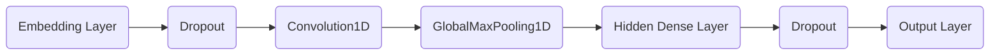
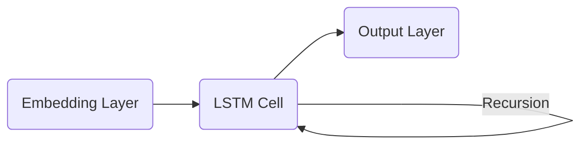

Classifying text with TensorFlow Estimators
===
*Posted by Sebastian Ruder and Julian Eisenschlos, Google Developer Experts*

Hello there! Throughout this post we will show you how to classify text using Estimators in TensorFlow. Here’s the outline of what we’ll cover:

-   Loading data using Datasets.
-   Building baselines using pre-canned estimators.
-   Using word embeddings.
-   Building custom estimators with convolution and LSTM layers.
-   Loading pre-trained word vectors.
-   Evaluating and comparing models using TensorBoard.

----------

Welcome to Part 4 of a blog series that introduces TensorFlow Datasets and Estimators. You don't need to read all of the previous material, but take a look if you want to refresh any of the following concepts. [Part 1](https://developers.googleblog.com/2017/09/introducing-tensorflow-datasets.html) focused on pre-made Estimators, [Part 2](https://developers.googleblog.com/2017/11/introducing-tensorflow-feature-columns.html) discussed feature columns, and [Part 3](https://developers.googleblog.com/2017/12/creating-custom-estimators-in-tensorflow.html) how to create custom Estimators.  

Here in Part 4, we will build on top of all the above to tackle a different family of problems in Natural Language Processing (NLP). In particular, this article demonstrates how to solve a text classification task using custom TensorFlow estimators, embeddings, and the [tf.layers](https://www.tensorflow.org/api_docs/python/tf/layers) module. Along the way, we'll learn about word2vec and transfer learning as a technique to bootstrap model performance when labeled data is a scarce resource.

We will show you relevant code snippets. [Here](https://github.com)'s the complete Jupyter Notebook  that you can run locally or on [Google Colaboratory](https://colab.research.google.com). The plain `.py`  source file is also available [here](https://github.com). Note that the code was written to demonstrate how Estimators work functionally and was not optimized for maximum performance.

### The task

The dataset we will be using is the IMDB [Large Movie Review Dataset](http://ai.stanford.edu/~amaas/data/sentiment/), which consists of $25,000$ highly polar movie reviews for training, and $25,000$ for testing. We will use this dataset to train a binary classification model, able to predict whether a review is positive or negative.

For illustration, here's a piece of a negative review (with $2$ stars) in the dataset:

> Now, I LOVE Italian horror films. The cheesier they are, the better. However, this is not cheesy Italian. This is week-old spaghetti sauce with rotting meatballs. It is amateur hour on every level. There is no suspense, no horror, with just a few drops of blood scattered around to remind you that you are in fact watching a horror film. 

*Keras* provides a convenient handler for importing the dataset which is also available as a serialized numpy array `.npz` file to download [here]( https://s3.amazonaws.com/text-datasets/imdb.npz). For text classification, it is standard to limit the size of the vocabulary to prevent the dataset from becoming too sparse and high dimensional, causing potential overfitting. For this reason, each review consists of a series of word indexes that go from $4$ (the most frequent word in the dataset **the**) to $4999$, which corresponds to **orange**. Index $1$ represents the beginning of the sentence and the index $2$ is assigned to all unknown (also known as *out-of-vocabulary* or *OOV*) tokens. These indexes have been obtained by pre-processing the text data in a pipeline that cleans, normalizes and tokenizes each sentence first and then builds a dictionary indexing each of the tokens by frequency.

After we've loaded the data in memory we pad each of the sentences with $0$ to a fixed size (here: $200$) so that we have two $2$-dimensional $25000\times200$ arrays for training and testing respectively.

```python load_data.py
vocab_size = 5000
sentence_size = 200
(x_train_variable, y_train), (x_test_variable, y_test) = imdb.load_data(num_words=vocab_size)
x_train = sequence.pad_sequences(
    x_train_variable, 
    maxlen=sentence_size, 
    padding='post', 
    value=0)
x_test = sequence.pad_sequences(
    x_test_variable,
    maxlen=sentence_size, 
    padding='post', 
    value=0)
```

### Input Functions

The Estimator framework uses *input functions* to split the data pipeline from the model itself. Several helper methods are available to create them, whether your data is in a `.csv` file, or in a `pandas.DataFrame`, whether it fits in memory or not. In our case, we can use `Dataset.from_tensor_slices` for both the train and test sets.

```python input_function.py
x_len_train = np.array([min(len(x), sentence_size) for x in x_train_variable])
x_len_test = np.array([min(len(x), sentence_size) for x in x_test_variable])

def parser(x, length, y):
    features = {"x": x, "len": length}
    return features, y

def train_input_fn():
    dataset = tf.data.Dataset.from_tensor_slices((x_train, x_len_train, y_train))
    dataset = dataset.shuffle(buffer_size=len(x_train_variable))
    dataset = dataset.batch(100)
    dataset = dataset.map(parser)
    dataset = dataset.repeat()
    iterator = dataset.make_one_shot_iterator()
    return iterator.get_next()

def eval_input_fn():
    dataset = tf.data.Dataset.from_tensor_slices((x_test, x_len_test, y_test))
    dataset = dataset.batch(100)
    dataset = dataset.map(parser)
    iterator = dataset.make_one_shot_iterator()
    return iterator.get_next()
```
We shuffle the training data and do not predefine the number of epochs we want to train, while we only need one epoch of the test data for evaluation. We also add an additional `"len"` key that captures the length of the original, unpadded sequence, which we will use later.

### Building a baseline

It's good practice to start any machine learning project trying basic baselines. The simpler the better as having a simple and robust baseline is key to understanding exactly how much we are gaining in terms of performance by adding extra complexity. It may very well be the case that a simple solution is good enough for our requirements.

With that in mind, let us start by trying out one of the simplest models for text classification. That would be a sparse linear model that gives a weight to each token and adds up all of the results, regardless of the order. As this model does not care about the order of words in a sentence, we normally refer to it as a *Bag-of-Words* approach. Let's see how we can implement this model using an `Estimator`.

We start out by defining the feature column that is used as input to our classifier. As we have seen in [Part 2](https://developers.googleblog.com/2017/11/introducing-tensorflow-feature-columns.html), `categorical_column_with_identity` is the right choice for this pre-processed text input. If we were feeding raw text tokens other `feature_columns` could do a lot of the pre-processing for us. We can now use the pre-made `LinearClassifier`.

```python bow_sparse_classifier.py
column = tf.feature_column.categorical_column_with_identity('x', vocab_size)
classifier = tf.estimator.LinearClassifier(
    feature_columns=[column], 
    model_dir=os.path.join(model_dir, 'bow_sparse'))
```

Finally, we create a simple function that trains the classifier and additionally creates a precision-recall curve. As we do not aim to maximize performance in this blog post, we only train our models for $25,000$ steps.

```python train.py
def train_and_evaluate(classifier):
    classifier.train(input_fn=train_input_fn, steps=25000)
    eval_results = classifier.evaluate(input_fn=eval_input_fn)
    predictions = np.array([p['logistic'][0] for p in classifier.predict(input_fn=eval_input_fn)])
    tf.reset_default_graph() 
    # Add a PR summary in addition to the summaries that the classifier writes
    pr = summary_lib.pr_curve('precision_recall', predictions=predictions, labels=y_test.astype(bool), num_thresholds=21)
    with tf.Session() as sess:
        writer = tf.summary.FileWriter(os.path.join(classifier.model_dir, 'eval'), sess.graph)
        writer.add_summary(sess.run(pr), global_step=0)
        writer.close()
        
train_and_evaluate(classifier)
```

One of the benefits of choosing a simple model is that it is much more interpretable. The more complex a model, the harder it is to inspect and the more it tends to work like a black box. In this example, we can load the weights from our model's last checkpoint and take a look at what tokens correspond to the  biggest weights in absolute value. The results look like what we would expect.

```python plot_weights.py
# Load the tensor with the model weights
weights = classifier.get_variable_value('linear/linear_model/x/weights').flatten()
# Find biggest weights in absolute value
extremes = np.concatenate((sorted_indexes[-8:], sorted_indexes[:8]))
# word_inverted_index is a dictionary that maps from indexes back to tokens
extreme_weights = sorted(
    [(weights[i], word_inverted_index[i]) for i in extremes])
# Create plot
y_pos = np.arange(len(extreme_weights))
plt.bar(y_pos, [pair[0] for pair in extreme_weights], align='center', alpha=0.5)
plt.xticks(y_pos, [pair[1] for pair in extreme_weights], rotation=45, ha='right')
plt.ylabel('Weight')
plt.title('Most significant tokens') 
plt.show()
```


As we can see, tokens with the most positive weight such as 'refreshing' are clearly associated with positive sentiment, while tokens that have a large negative weight unarguably evoke negative emotions. A simple but powerful modification that one can do to improve this model is weighting the tokens by their [tf-idf](https://en.wikipedia.org/wiki/Tf%E2%80%93idf) scores.

### Embeddings

The next step of complexity we can add are word embeddings. Embeddings are a dense low-dimensional representation of sparse high-dimensional data. This allows our model to learn a more meaningful representation of each token, rather than just an index. While an individual dimension is not meaningful, the low-dimensional space---when learned from a large enough corpus---has been shown to capture relations such as tense, plural, gender, thematic relatedness, and many more. We can add word embeddings by converting our existing feature column into an `embedding_column`. The representation seen by the model is the mean of the embeddings for each token (see the `combiner` argument in the [docs](https://www.tensorflow.org/api_docs/python/tf/feature_column/embedding_column)). We can plug in the embedded features into a pre-canned `DNNClassifier`.

A note for the keen observer: an `embedding_column` is just an efficient way of applying a fully connected layer to the sparse binary feature vector of tokens, which is multiplied by a constant depending of the chosen combiner. A direct consequence of this is that it wouldn't make sense to use an `embedding_column` directly in a `LinearClassifier` because two consecutive linear layers without non-linearities in between add no prediction power to the model, unless of course the embeddings are pre-trained.

```python bow_dense_classifier.py
embedding_size = 50
word_embedding_column = tf.feature_column.embedding_column(
    column, dimension=embedding_size)
classifier = tf.estimator.DNNClassifier(
    hidden_units=[100],
    feature_columns=[word_embedding_column], 
    model_dir=os.path.join(model_dir, 'bow_embeddings'))
train_and_evaluate(classifier)
```

We can use TensorBoard to visualize our $50$-dimensional word vectors projected into $\mathbb{R}^3$ using [t-SNE](https://en.wikipedia.org/wiki/T-distributed_stochastic_neighbor_embedding). We expect similar words to be close to each other. This can be a useful way to inspect our model weights and find unexpected behaviours.


### Convolutions

At this point one possible approach would be to go deeper, further adding more fully connected layers and playing around with layer sizes and training functions. However, by doing that we would add extra complexity and ignore important structure in our sentences. Words do not live in a vacuum and meaning is compositional, formed by words and its neighbors.

Convolutions are one way to take advantage of this structure, similar to how we can model salient clusters of pixels for [image classification](https://www.tensorflow.org/tutorials/layers). The intuition is that certain sequences of words, or *n-grams*, usually have the same meaning regardless of their overall position in the sentence. Introducing a structural prior via the convolution operation allows us to model the interaction between neighboring words and consequently gives us a better way to represent such meaning.

The following image shows how a filter matrix $F \in \mathbb{R}^{d\times m}$ slides across each $3$-gram window of tokens to build a new feature map. Afterwards a *pooling* layer is usually applied to combine adjacent results.

 
<small><p align="center">
Source: <a href="https://www.semanticscholar.org/paper/Learning-to-Rank-Short-Text-Pairs-with-Convolution-Severyn-Moschitti/452f7411af7d471dd3ba84c2b06b2aaffc38cdb9">Learning to Rank Short Text Pairs with Convolutional Deep Neural Networks</a> by <strong>Severyn</strong> et al. [2015]
</p></small>


Let us look at the full model architecture. The use of dropout layers is a regularization technique that makes the model less likely to overfit.



### Creating a custom estimator

As seen in previous blog posts, the `tf.estimator` framework provides a high-level API for training machine learning models, defining `train()`, `evaluate()` and `predict()` operations, handling checkpointing, loading, initializing, serving, building the graph and the session out of the box. There is a small family of pre-made estimators, like the ones we used earlier, but it's most likely that you will need to [build your own](https://www.tensorflow.org/extend/estimators).

Writing a custom estimator means writing a `model_fn(features, labels, mode, params)` that returns an `EstimatorSpec`. The first step will be mapping the features into our embedding layer:

```python embeddings.py
input_layer = tf.contrib.layers.embed_sequence(
    features['x'], 
    vocab_size, 
    embedding_size,
    initializer=params['embedding_initializer'])
```
Then we use `tf.layers` to process each output sequentially.
```python cnn_classifer.py
training = (mode == tf.estimator.ModeKeys.TRAIN)
dropout_emb = tf.layers.dropout(inputs=input_layer, 
                                rate=0.2, 
                                training=training)
conv = tf.layers.conv1d(
    inputs=dropout_emb,
    filters=32,
    kernel_size=3,
    padding="same",
    activation=tf.nn.relu)
pool = tf.reduce_max(input_tensor=conv, axis=1)
hidden = tf.layers.dense(inputs=pool, units=250, activation=tf.nn.relu)
dropout = tf.layers.dropout(inputs=hidden, rate=0.2, training=training)
logits = tf.layers.dense(inputs=dropout_hidden, units=1)
```

Finally, we will use a `Head` to simplify the writing of our last part of the `model_fn`. The head already knows how to compute predictions, loss, train_op, metrics and export outputs, and can be reused across models. This is also used in the pre-made estimators and provides us with the benefit of a uniform evaluation function across all of our models. We will use `binary_classification_head`, which is a head for single label binary classification that uses `sigmoid_cross_entropy_with_logits` as the loss function under the hood.

```python model_head.py
head = tf.contrib.estimator.binary_classification_head()
optimizer = tf.train.AdamOptimizer()    
def _train_op_fn(loss):
    tf.summary.scalar('loss', loss)
    return optimizer.minimize(
        loss=loss,
        global_step=tf.train.get_global_step())

return head.create_estimator_spec(
    features=features,
    labels=labels,
    mode=mode,
    logits=logits,
    train_op_fn=_train_op_fn)
```
Running this model is just as easy as before:
```python train_cnn.py
initializer = tf.random_uniform([vocab_size, embedding_size], -1.0, 1.0))
params = {'embedding_initializer': initializer}
cnn_classifier = tf.estimator.Estimator(model_fn=model_fn,
                                        model_dir=os.path.join(model_dir, 'cnn'),
                                        params=params)
train_and_evaluate(cnn_classifier)
```

### LSTM Networks

Using the `Estimator` API and the same model `head`, we can also create a classifier that uses a *Long Short-Term Memory* (*LSTM*) cell instead of convolutions. Recurrent models such as this are some of the most successful building blocks for NLP applications. An LSTM processes the entire document sequentially, recursing over the sequence with its cell while storing the current state of the sequence in its memory.

One of the drawbacks of recurrent models compared to CNNs is that, because of the nature of recursion, models turn out deeper and more complex, which usually produces slower training time and worse convergence. LSTMs (and RNNs in general) can suffer convergence issues like vanishing or exploding gradients, that said, with sufficient tuning they can obtain state-of-the-art results for many problems. As a rule of thumb CNNs are good at feature extraction, while RNNs excel at tasks that depend on the meaning of the whole sentence, like question answering or machine translation.

Each cell processes one token embedding at a time updating its internal state based on a differentiable computation that depends on both the embedding vector $x_t$ and the previous state $h_{t-1}$. In order to get a better understanding of how LSTMs work, you can refer to Chris Olah’s [blog post](https://colah.github.io/posts/2015-08-Understanding-LSTMs/).


<small><p align="center">
Source: <a href="https://colah.github.io/posts/2015-08-Understanding-LSTMs/">Understanding LSTM Networks</a> by <strong>Chris Olah</strong>
</p></small>


The complete LSTM model can be expressed by the following simple flowchart:

In the beginning of this post, we padded all documents up to $200$ tokens, which is necessary to build a proper tensor. However, when a document contains fewer than $200$ words, we don't want the LSTM to continue processing padding tokens as it does not add information and degrades performance. For this reason, we additionally want to provide our network with the length of the original sequence before it was padded. Internally, the model then copies the last state through to the sequence's end. We can do this by using the `"len"` feature in our input functions. We can now use the same logic as above and simply replace the convolutional, pooling, and flatten layers with our LSTM cell.

```python lstm_classifier.py
lstm_cell = tf.nn.rnn_cell.BasicLSTMCell(100)
_, final_states = tf.nn.dynamic_rnn(
        lstm_cell, inputs, sequence_length=features['len'], dtype=tf.float32)
logits = tf.layers.dense(inputs=final_states.h, units=1)
```

### Pre-trained vectors

Most of the models that we have shown before rely on word embeddings as a first layer. So far, we have initialized this embedding layer randomly. However, [much](https://arxiv.org/abs/1607.01759) [previous](https://arxiv.org/abs/1301.3781) [work](https://arxiv.org/abs/1103.0398) has shown that using embeddings pre-trained on a large unlabeled corpus as initialization is beneficial, particularly when training on only a small number of labeled examples. The most popular pre-trained embedding is [word2vec](https://www.tensorflow.org/tutorials/word2vec). Leveraging knowledge from unlabeled data via pre-trained embeddings is an instance of *[transfer learning](http://ruder.io/transfer-learning/)*.

To this end, we will show you how to use them in an `Estimator`. We will use the pre-trained vectors from another popular model, [GloVe](https://nlp.stanford.edu/projects/glove/).
```python load_glove.py
embeddings = {}
with open('glove.6B.50d.txt', 'r', encoding='utf-8') as f:
    for line in f:
        values = line.strip().split()
        w = values[0]
        vectors = np.asarray(values[1:], dtype='float32')
        embeddings[w] = vectors
```

After loading the vectors into memory from a file we store them as a `numpy.array` using the same indexes as our vocabulary. The created array is of shape `(5000, 50)`. At every row index, it contains the `50`-dimensional vector representing the word at the same index in our vocabulary.

```python create_glove_matrix.py
embedding_matrix = np.random.uniform(-1, 1, size=(vocab_size, embedding_size))
for w, i in word_index.items():
    v = embeddings.get(w)
    if v is not None and i < vocab_size:
        embedding_matrix[i] = v
```

Finally, we can use a custom initializer function and pass it in the `params` object to our `cnn_model_fn` , without any modifications. 

```python custom_initializer.py
def my_initializer(shape=None, dtype=tf.float32, partition_info=None):
    assert dtype is tf.float32
    return embedding_matrix
params = {'embedding_initializer': my_initializer}
cnn_pretrained_classifier = tf.estimator.Estimator(
    model_fn=cnn_model_fn,
    model_dir=os.path.join(model_dir, 'cnn_pretrained'),
    params=params)
train_and_evaluate(cnn_pretrained_classifier)
```

### Running TensorBoard

Now we can launch TensorBoard and see how the different models we've trained compare against each other in terms of training time and performance.

In a terminal, we run
```bash
> tensorboard --logdir={model_dir}
```
We can visualize many metrics collected while training and testing, including the loss function values of each model at each training step, and the precision-recall curves. This is of course most useful to select which model works best for our use-case as well as how to choose classification thresholds.


### Getting Predictions

To obtain predictions on new sentences we can use the `predict` method in the `Estimator` instances, which will load the latest checkpoint for each model and evaluate on the unseen examples. But before passing the data into the model we have to clean up, tokenize and map each token to the corresponding index as we see below.

```python predict.py
def text_to_index(sentence):
    # Remove punctuation characters except for the apostrophe
    translator = str.maketrans('', '', string.punctuation.replace("'", ''))
    tokens = sentence.translate(translator).lower().split()
    return np.array([1] + [word_index[t] if t in word_index else 2 for t in tokens])

def print_predictions(sentences, classifier):
    indexes = [text_to_index(sentence) for sentence in sentences]
    x = sequence.pad_sequences(indexes,
                               maxlen=sentence_size, 
                               padding='post', 
                               value=0)
    length = np.array([min(len(x), sentence_size) for x in indexes])
    predict_input_fn = tf.estimator.inputs.numpy_input_fn(x={"x": x, "len": length}, shuffle=False)
    predictions = [p['logistic'][0] for p in classifier.predict(input_fn=predict_input_fn)]
    print(predictions)
```

It is worth noting that the checkpoint itself is not sufficient to make predictions; the actual code used to build the estimator is necessary as well in order to map the saved weights to the corresponding tensors. It's a good practice to associate saved checkpoints with the branch of code with which they were created.

If you are interested in exporting the models to disk in a fully recoverable way, you might want to look into the [SavedModel](https://www.tensorflow.org/programmers_guide/saved_model#using_savedmodel_with_estimators) class, which is especially useful for serving your model through an API using [TensorFlow Serving](https://github.com/tensorflow/serving).

### Summary

In this blog post, we explored how to use estimators for text classification, in particular for the IMDB Reviews Dataset. We trained and visualized our own embeddings, as well as loaded pre-trained ones. We started from a simple baseline and made our way to convolutional neural networks and LSTMs.

For more details, be sure to check out:

 * A [Jupyter notebook](https://github.com/eisenjulian/nlp_estimator_tutorial/blob/master/nlp_estimators.ipynb) that can run locally, or on Colaboratory.
 * The complete [source code](https://github.com/eisenjulian/nlp_estimator_tutorial/blob/master/nlp_estimators.py) for this blog post.
 * The TensorFlow [Embedding](https://www.tensorflow.org/programmers_guide/embedding) guide.
 * The TensorFlow [Vector Representation of Words](https://www.tensorflow.org/tutorials/word2vec) tutorial.
 * The *NLTK* [Processing Raw Text](http://www.nltk.org/book/ch03.html) chapter on how to design langage pipelines.

In a following post, we will show how to build a model using eager execution, work with out-of-memory datasets, train in Cloud ML, and deploy with TensorFlow Serving.

----------

*Thanks for reading! If you like you can find us online at [ruder.io](http://ruder.io/) and [@eisenjulian](https://twitter.com/eisenjulian). Send our way all your feedback and questions.*
<!--stackedit_data:
eyJwcm9wZXJ0aWVzIjoiIyBBZGQgY3VzdG9tIHByb3BlcnRpZX
MgZm9yIHRoZSBjdXJyZW50IGZpbGUgaGVyZVxuIyB0byBvdmVy
cmlkZSB0aGUgZGVmYXVsdCBwcm9wZXJ0aWVzLlxudGl0bGU6IE
NsYXNzaWZ5aW5nIHRleHQgd2l0aCBUZW5zb3JGbG93IEVzdGlt
YXRvcnNcbmF1dGhvcjogU2ViYXN0aWFuIFJ1ZGVyLCBTZWJhc3
RpYW4gUnVkZXJcbnRhZ3M6IFRlbnNvckZsb3csIEVzdGltYXRv
ciwgTkxQXG5jYXRlZ29yaWVzOiBUZW5zb3JGbG93LCBFc3RpbW
F0b3IsIE5MUFxuI2V4Y2VycHQ6XG4jZmVhdHVyZWRJbWFnZTpc
biNzdGF0dXM6IGRyYWZ0XG5kYXRlOiAyMDE4LTAyLTE1IDExOj
AwOjAwXG4iLCJoaXN0b3J5IjpbMTkyMzU0MTc4MSwtMTg1NDU0
NTI5NCwtMjA4NjI2MTc3LDM2NDEwNzg2OV19
-->