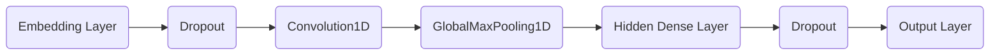

Classifying text with TensorFlow Estimators
===
*Posted by Sebastian Ruder and Julian Eisenschlos, Google Developer Experts*

Welcome to Part 4 of a blog series that introduces TensorFlow Datasets and Estimators. [Part 1](https://developers.googleblog.com/2017/09/introducing-tensorflow-datasets.html) focused on pre-made Estimators, [Part 2](https://developers.googleblog.com/2017/11/introducing-tensorflow-feature-columns.html) discussed feature columns, and [Part 3](https://developers.googleblog.com/2017/12/creating-custom-estimators-in-tensorflow.html) how to create custom Estimators.  Here on Part 4 we will build on top of all the above to tackle a different family of problems in Natural Language Processing. In particular, this article demonstrates how to solve a text classification task using custom TensorFlow estimators, embeddings and the [tf.layers](https://www.tensorflow.org/api_docs/python/tf/layers) module. Along the way we'll learn about word2vec and transfer learning as a technique to bootstrap model performance when labeled data is a scarce resource.

We will show you relevant code snippets. [Here](https://github.com)'s a more complete Jupyter Notebook  that you can fully run locally or on [Google Collaborary](https://colab.research.google.com). The plain `.py`  source file is also available [here](https://github.com). Note that the code was written to demonstrate how Estimators work functionally, and was not optimized for maximum performance.

### The task

The dataset we wil be using is the IMDB [Large Movie Review Dataset](http://ai.stanford.edu/~amaas/data/sentiment/), which consists of $25,000$ highly polar movie reviews for training, and $25,000$ for testing. We will use this dataset to train a binary classifiation model, able to predict whether a review is positive or negative.

For illustration, here's a piece of a negative review (with 2 stars) in the dataset:
> Now, I LOVE Italian horror films. The cheesier they are, the better. However, this is not cheesy Italian. This is week-old spaghetti sauce with rotting meatballs. It is amateur hour on every level. There is no suspense, no horror, with just a few drops of blood scattered around to remind you that you are in fact watching a horror film. 

*Keras* provides a convenient handler for importing the dataset which is also available as a serialized numpy array `.npz` file to download [here]( https://s3.amazonaws.com/text-datasets/imdb.npz). Each review consists of a series of word indexes that go from $4$ (the most frequent word in the dataset **the**) to $4999$, which corresponds to **orange**. Index $1$ represents the beginning of the sentence and the index $2$ is assigned to all unknown (also known as *out-of-vocabulary* or *OOV*) tokens. These indexes have been obtained by pre-processing the text data in a pipeline that cleans, normalizes and tokenizes each sentence first and then builds a dictionary indexing each of the tokens by frequency. We are not convering these techniques in this post, but you can take a look at [this chapter](http://www.nltk.org/book/ch03.html) of the NLTK book to learn more.

It's standard to limit the size of the vocabulary to prevent the dataset from becoming too sparse and high dimensional, causing potential overfitting. After we've loaded the data in memory we pad each of the sentences with zeroes to a fixed size (here: $400$) so that we have two $2$-dimensional $25000\times400$ arrays for training and testing respectively.

```python
vocab_size = 5000
sentence_size = 400
(x_train_variable, y_train), (x_test_variable, y_test) = imdb.load_data(num_words=vocab_size)
x_train = sequence.pad_sequences(x_train_variable, maxlen=sentence_size)
x_test = sequence.pad_sequences(x_test_variable, maxlen=sentence_size)
```

### Input Functions

The Estimator framework uses *input functions* to split the data pipeline from the model itself. Several helper methods are available to create them, whether your data is in a `.csv` file, or in a `pandas.DataFrame`, whether it fits in memory or not. In our case, we can use `numpy_input_fn` for both the train and test sets.

```python
train_input_fn = tf.estimator.inputs.numpy_input_fn(
    x={"x": x_train, "len": np.array([max(len(x), sentence_size) for x in x_train_variable])},
    y=y_train,
    batch_size=100,
    num_epochs=None,
    shuffle=True)

eval_input_fn = tf.estimator.inputs.numpy_input_fn(
    x={"x": x_test, "len": np.array([max(len(x), sentence_size) for x in x_test_variable])},
    y=y_test,
    num_epochs=1,
    shuffle=False)
```
We shuffle the training data and do not predefine the number of epochs we want to train, while we only need one epoch of the test data for evaluation. We also add an additional `"len"` key that captures the length of the original, unpadded sequence, which we will use later.

### Building a baseline

It's always a good practice to start any machine learning project trying basic baselines. Simple is always better and it's key to understand exactly how much we are winning in terms of performance by adding extra complexity. It may very well be the case that a simple solution is good enough for our requirements.

With that in mind, let us start by trying out one of the simplest models out there for text classification. That is, a sparse linear model that gives a weight to each token and adds up all of the results, regardless of the order. The fact we don't care about order in the sentence is what is normally referred as a *Bag-of-Words* approach. Let's see how that works out.

We start out by defining the feature column that is used as input to our classifier. As we've seen [Part 2](https://developers.googleblog.com/2017/11/introducing-tensorflow-feature-columns.html), `categorical_column_with_identity` is the right choice for text input. We can now use the pre-made `LinearClassifier`.


```python
column = tf.feature_column.categorical_column_with_identity('x', vocab_size)
classifier = tf.estimator.LinearClassifier(
    feature_columns=[column], 
    model_dir=os.path.join(model_dir, 'bow_sparse'))
```

Finally, we create a simple function that trains the classifier and additionally creates a precision-recall curve. Note that we do not aim to maximize performance in this blog post, so we only train our models for $25,000$ steps.

```python
def train_and_evaluate(classifier):
    classifier.train(input_fn=train_input_fn, steps=25000)
    eval_results = classifier.evaluate(input_fn=eval_input_fn)
    predictions = np.array([p['logistic'][0] for p in classifier.predict(input_fn=eval_input_fn)])
    tf.reset_default_graph() 
    # Add a PR summary in addition to the summaries that the classifier writes
    pr = summary_lib.pr_curve('precision_recall', predictions=predictions, labels=y_test.astype(bool), num_thresholds=21)
    with tf.Session() as sess:
        writer = tf.summary.FileWriter(os.path.join(classifier.model_dir, 'eval'), sess.graph)
        writer.add_summary(sess.run(pr), global_step=0)
        writer.close()
        
train_and_evaluate(classifier)
```

One of the benefits of choosing a simple model is that it's much more inspectable. The more complex the model is, the more it tends to work like a black box. In this example we can load the weights from our model's last checkpoint and take a look at what tokens correspond to the  biggest weights in absolute value. The results looks like what we would expect.

```python
# Load the latest checkpoint
linear_model_checkpoint = saver.latest_checkpoint(
	os.path.join(model_dir, 'bow_sparse'))
reader = pywrap_tensorflow.NewCheckpointReader(linear_model_checkpoint)
weights = np.array(reader.get_tensor('linear/linear_model/x/weights')).flatten()
# Find biggerst weights in absolute value
extremes = np.concatenate((
    np.argpartition(weights, -8)[-8:], 
    np.argpartition(weights, 8)[:8]))
# word_inverted_index is a dictionary that maps from indexes back to tokens
extreme_weights = sorted(
    [(weights[i], word_inverted_index[i - index_offset]) for i in extremes])
# Create plot
y_pos = np.arange(len(extreme_weights))
plt.bar(y_pos, [pair[0] for pair in extreme_weights], align='center', alpha=0.5)
plt.xticks(y_pos, [pair[1] for pair in extreme_weights], rotation=45, ha='right')
plt.ylabel('Weight')
plt.title('Most significant tokens') 
plt.show()
```


As we can see, tokens with the most positive weight such as 'refreshing' are clearly associated with positive sentiment, while tokens that have a large negative weight unarguably evoke negative emotions.

### Embeddings

The next step of complexity we can add are word embeddings. Embeddings are a dense low-dimensional representation of sparse high-dimensional data. This allows our model to learn a more meaningful representation of each token, rather than just an index. While an individual dimension is not meaningful, the low-dimensional space---when learned from a enough large corpus---has been shown to capture relations such as tense, plural, gender, thematic relatedness, and many more. We can add word embeddings by converting our existing feature column into an `embedding_column`. This is effectively the same as adding a fully connected second layer to our previous attempt, thus resulting in a 2-layer-deep feed forward network.


```python
embedding_size = 50
word_embedding_column = tf.feature_column.embedding_column(
    column, dimension=embedding_size)
classifier = tf.estimator.LinearClassifier(
    feature_columns=[word_embedding_column], 
    model_dir=os.path.join(model_dir, 'bow_embeddings'))
train_and_evaluate(classifier)
```    

We can use TensorBoard to visualize a our $50$-dimensional word vectors projected into $\mathbb{R}^3$ using [t-SNE](https://en.wikipedia.org/wiki/T-distributed_stochastic_neighbor_embedding). We expect similar words to be close to each other. This can be a useful way to inspect our model weights and find unexpected behaviours. There's plenty of information available to [explore further](https://www.tensorflow.org/programmers_guide/embedding).


### Convolutions

At this point one possible apprach would be to go deeper, further adding more fully connected layers and playing around with layer sizes and training functions. However, by doing that we would add extra complexity and ignore important structure in our sentences. Tokens don't live in a vacuum and meaning is compositional, formed by tokens and its neighbours.

Convolutions are one way to take advantage of this structure, similar to how we can model salient clusters of pixels for [image classification](https://www.tensorflow.org/tutorials/layers). The intuition is that small parts of a sentence, or *n-grams*, usually have the same meaning regardless of their overall position in the sentence. Introducing a structural prior via the convolution allows us to model the interaction between neighbouring tokens and consequently gives us a better way to represent such meaning.



### Creating a custom estimator

As seen in previous blog posts, the `tf.estimator` framework provides a higher level API for training machine learning models, defining `train()`, `evaluate()` and `predict()` operations, handling checkpointing, loading, initializing, serving, building the graph and the session out of the box. One the many benefits it provides is that the same code will be able to run in CPUs, GPUs and even in a distributed setup. There's a small family of pre-made estimators, like the ones we used earlier, but it's most likely that you will need to build your own. [This](https://www.tensorflow.org/extend/estimators) guide contains a thorough explanation on how to do it.

Writing a custom estimator means writing a `model_fn(features, labels, mode)`. First step will be mapping the features into our embedding layer:

```python
initializer = tf.random_uniform([vocab_size, embedding_size], -1.0, 1.0))
embeddings = tf.get_variable('embeddings', initializer=initializer)
input_layer = tf.nn.embedding_lookup(embeddings, features['x'])
```

----------
Raw unchecked export the notebook from here onwards
----------

We will use a `Head` to simplify the writing of our model function `model_fn`. The head already knows how to compute predictions, loss, train_op, metrics and export outputs, and can be reused across models. This is also used on the canned estimators, so we get the benefit a uniform evaluation function across all of our models. We will use `_binary_logistic_head_with_sigmoid_cross_entropy_loss`, which is a head for single label binary classification that uses `sigmoid_cross_entropy_with_logits` loss.


```python
head = head_lib._binary_logistic_head_with_sigmoid_cross_entropy_loss()
    
    dropout_emb = tf.layers.dropout(inputs=input_layer, rate=0.2, training=mode == tf.estimator.ModeKeys.TRAIN)

    conv = tf.layers.conv1d(
        inputs=dropout_emb,
        filters=32,
        kernel_size=3,
        padding="same",
        activation=tf.nn.relu)

    # This is supposed to be Global Max Pooling, but there is not such a layer
    pool = tf.layers.max_pooling1d(
        inputs=conv, 
        padding="valid", 
        pool_size=sentence_size, 
        strides=sentence_size)

    flat = tf.layers.flatten(inputs=pool)

    hidden = tf.layers.dense(inputs=flat, units=250, activation=tf.nn.relu)
    
    dropout = tf.layers.dropout(inputs=hidden, rate=0.2, training=mode == tf.estimator.ModeKeys.TRAIN)
    
   logits = tf.layers.dense(inputs=dropout, units=1)
    
    # This will be None when predicting
    if labels is not None:
        labels = tf.reshape(labels, [-1, 1])

    optimizer = tf.train.AdamOptimizer()
    
    def _train_op_fn(loss):
        tf.summary.scalar('loss', loss)
        return optimizer.minimize(
            loss=loss,
            global_step=tf.train.get_global_step())

    return head.create_estimator_spec(
        features=features,
        labels=labels,
        mode=mode,
        logits=logits,
        train_op_fn=_train_op_fn)
```


```python
cnn_classifier = tf.estimator.Estimator(model_fn=cnn_model_fn,
                                        model_dir=model_dir + 'cnn2')
train_and_evaluate(cnn_classifier)
```

### LSTM Networks

Using the `Estimator` API and the same model `head`, we can also create a classifier that uses a Long Short-Term Memory (LSTM) cell instead of convolutions. Recursive models such as this are some of the most successful building blocks for NLP applications.

An LSTM processes the entire document sequentially. In the beginning, we padded all documents up to 400 tokens, necessary to build a proper tensor. However, when a document contains fewer than 400 words, we don't want the LSTM to continue processing the padding token as it does not add information and degrades performance. For this reason, we additionally want to provide our LSTM with the length of the original sequence before it was padded. The LSTM then copies the last state through to the sequence's end. We can do this by using the `"len"` feature in our input functions.

We can use the same logic as above and simply need to replace the convolutional, pooling, and flatten layers with our LSTM cell.


```python
def lstm_model_fn(features, labels, mode):

    embeddings = tf.get_variable('embeddings',
                                 initializer=tf.random_uniform(
                                     [vocab_size,embedding_size], -1.0, 1.0))

    # [batch_size x sentence_size x embedding_size]
    inputs = tf.nn.embedding_lookup(embeddings, features['x'])

    # create an LSTM cell of size 100
    lstm_cell = tf.contrib.rnn.BasicLSTMCell(100)
    
    # create the complete LSTM
    _, final_states = tf.nn.dynamic_rnn(
        lstm_cell, inputs, sequence_length=features['len'], dtype=tf.float32)

    # get the final hidden states of dimensionality [batch_size x sentence_size]
    outputs = final_states.h

    logits = tf.layers.dense(inputs=outputs, units=1)

    labels = tf.reshape(labels, [-1, 1])

    optimizer = tf.train.AdamOptimizer()

    def _train_op_fn(loss):
        tf.summary.scalar('loss', loss)
        return optimizer.minimize(
            loss=loss,
            global_step=tf.train.get_global_step())

    return head.create_estimator_spec(
        features=features,
        labels=labels,
        mode=mode,
        logits=logits,
        train_op_fn=_train_op_fn)


lstm_classifier = tf.estimator.Estimator(model_fn=lstm_model_fn,
                                         model_dir=model_dir + 'lstm')
train_and_evaluate(lstm_classifier)
```

### Pretrained vectors

Most of the models that we have shown before rely on word embeddings as a first layer to increase performance, and we have so far initialized them at random, however it has been shown all [over](https://arxiv.org/abs/1607.01759) [the](https://arxiv.org/abs/1301.3781) [literature](https://arxiv.org/abs/1103.0398), that specially for small labelled datasets, a great benefit can be obtained by training a different model that also uses embeddings in a separate task that only needs a large unlabelled corpora, and share the results. One such task is shown [here](https://www.tensorflow.org/tutorials/word2vec). That technique is usually referre to as *transfer learning*.


With that end, we will show you one last model where the embeddings are fixed. We will use the pre-trained vectors from [GloVe](https://nlp.stanford.edu/projects/glove/) on the Wikipedia corpus. If you have a billion-word + corpus on your domain, it might be also be a good idea to use that one instead.

## Results

### Launching TensorBoard

Now we can launch Tensorboard and see how the different models we've trained compare against each other in terms of terms of training time and performance.

In a terminal, do
```
> tensorboard --logdir=/tmp/exp
```

### Getting Predictions

To get predictions on new sentences we can use the `predict` method in the `Estimator` instances, which will load the latest checkpoint for each model and evaluate on the unseen examples. But before passing the data into the model we have to clean up, tokenize and map each token to the corresponding index, as shown here.

It's worth noting that the checkpoint itelf is not enough to make predictions since the actual code used to build the estimator is necessary as well, in order to map the saved weights into the corresponding tensors, so it's a good practice associate saved checkpoints with the branch of code with which they were created.

If your are interested in exporting the models to disk in a fully recoverable way you might want to look into the [SavedModel](https://www.tensorflow.org/programmers_guide/saved_model#using_savedmodel_with_estimators) class, specially usefull for serving your model through an API using [TensorFlow Serving](https://github.com/tensorflow/serving).


```python
def text_to_index(sentence):
    # Remove punctutaion characters except for the apostrophe
    translator = str.maketrans('', '', string.punctuation.replace("'", ''))
    tokens = sentence.translate(translator).lower().split()
    return np.array([1] + [word_index[t] + index_offset if t in word_index else 2 for t in tokens])

def print_predictions(sentences):
    indexes = [text_to_index(sentence) for sentence in sentences]
    x = sequence.pad_sequences(indexes, maxlen=sentence_size)
    length = np.array([max(len(x), sentence_size) for x in indexes])
    predict_input_fn = tf.estimator.inputs.numpy_input_fn(x={"x": x, "len": length}, shuffle=False)
    predictions = {}
    for path, classifier in all_classifiers.items():
        predictions[path] = [p['logistic'][0] for p in classifier.predict(input_fn=predict_input_fn)]
    for idx, sentence in enumerate(sentences):
        print(sentence)
        for path in all_classifiers:
            print("\t{} {}".format(path, predictions[path][idx]))

# print(print(index_to_text(x_test_variable[5][1:])))
texts = [index_to_text(x_test_variable[i][1:]).replace('?', 'UNK65432') for i in range(25000) if y_test[i] == 0 and len(x_test_variable[i]) < 30][:20]
# print_predictions(texts)
print_predictions([
    "I really liked the movie!", 
    "Hated every second of it..."
])
```
    

### Other resources

We hope you have found this Tutorial usefull, here are some useful references if you want to continue digging in the subject of estimators and text classification.

In the next series of this post we will show how to build a model using RNNs and eagear execution, work with out of memory datasets, train in Cloud ML and deploy with TensorFlow serving

<!--stackedit_data:
eyJoaXN0b3J5IjpbLTE3NTM0MTAwODJdfQ==
-->